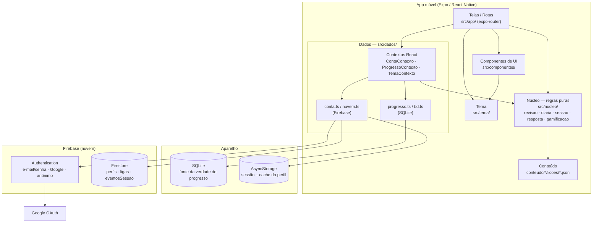
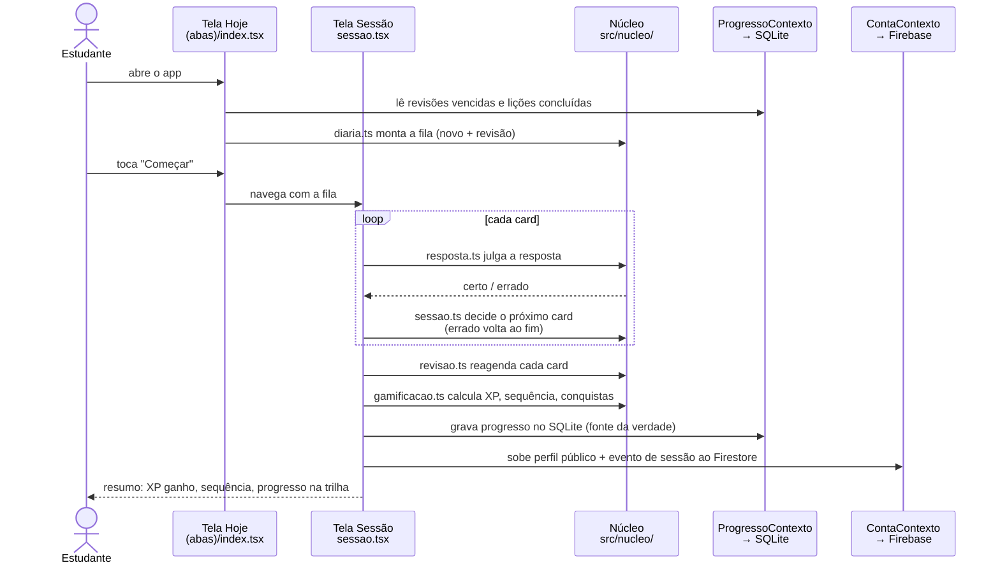
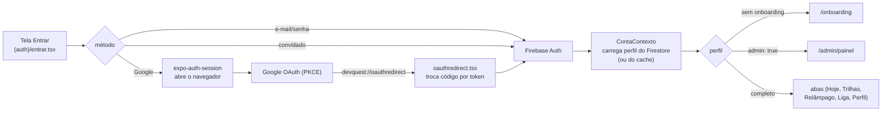

# DevQuest — Arquitetura do Sistema

## 1. Visão geral

O DevQuest é um aplicativo móvel (Android primeiro) construído com
**Expo + React Native + TypeScript**. É um app *offline-first*: todo o
progresso do estudante fica no aparelho (SQLite) e só o que precisa ser
comparado entre pessoas — perfil público, ranking da liga — sobe para a nuvem
(Firebase).

A arquitetura interna é dividida em **quatro camadas**, cada uma numa pasta
própria, com uma regra de dependência clara: as camadas de cima conhecem as de
baixo, nunca o contrário.

| Camada | Pasta | Responsabilidade | Pode importar |
|---|---|---|---|
| **Telas** | `src/app/` | rotas e telas (expo-router: o nome do arquivo é a rota) | componentes, dados, núcleo, tema |
| **Componentes** | `src/componentes/` | peças de UI reaproveitadas (botão, card, bloco de código, gráfico…) | núcleo, tema |
| **Dados** | `src/dados/` | persistência local (SQLite), nuvem (Firebase) e contextos React que expõem isso às telas | núcleo |
| **Núcleo** | `src/nucleo/` | regras de negócio **puras** — repetição espaçada, montagem da diária, julgamento de resposta, XP/ranks | nada de React ou React Native |

Fora das camadas de código:

| Pasta | O que é |
|---|---|
| `conteudo/` | as lições, em JSON, uma pasta por linguagem (C#, Java, JavaScript, PHP, Python) |
| `src/tema/` | cores, espaçamentos, fontes e paletas de tema |
| `docs/` | documentação e regras de segurança do Firestore |
| `hosting-legal/` | página pública de termos/privacidade (Firebase Hosting) |

### A regra mais importante

**`src/nucleo/` não conhece tela.** Nenhum arquivo ali importa React ou React
Native. Isso permite testar toda a lógica com `vitest` em Node puro
(`npm test`), sem emulador: uma regra de sequência ou de agendamento é
validada em segundos.

---

## 2. Tecnologias

| Camada | Tecnologia | Para quê |
|---|---|---|
| App | Expo SDK 54 + React Native 0.81 + TypeScript | o app em si |
| Navegação | expo-router | cada arquivo em `src/app/` vira uma rota |
| Dados locais | expo-sqlite | progresso, revisões agendadas, lições concluídas |
| Sessão/prefs | AsyncStorage | persistência do login e cache do perfil |
| Backend | Firebase (Auth + Firestore) | conta, perfil público, ligas, eventos de sessão |
| Login Google | expo-auth-session + expo-web-browser | OAuth com PKCE |
| Notificações | expo-notifications | lembrete diário local |
| Animações | react-native-reanimated / gesture-handler | movimento das telas |
| Testes | vitest | testa `src/nucleo/` em Node puro |
| Build | EAS (`eas.json`) | APK (`preview`) e build de produção |

---

## 3. Diagrama de componentes

---

## 4. Como as partes se comunicam

### 4.1 Telas → Contextos → Dados

As telas nunca falam com o SQLite ou com o Firebase diretamente. Elas usam
três **contextos React** (`src/dados/*Contexto.tsx`):

| Contexto | Expõe para as telas | Fala com |
|---|---|---|
| `ContaContexto` | usuário logado, perfil público, login/logout, atualizar perfil | `conta.ts` (Firebase Auth) e `nuvem.ts` (Firestore), com cache em AsyncStorage |
| `ProgressoContexto` | XP, sequência, revisões agendadas, lições concluídas | `progresso.ts` → `bd.ts` (SQLite) |
| `TemaContexto` | paleta de cores atual (`useCores()`) | `src/tema/temas.ts` |

`src/app/_layout.tsx` é o layout raiz: carrega as fontes, abre o SQLite,
inicia os três contextos e decide para onde mandar a pessoa
(entrar → onboarding → introdução → abas, ou direto para `/admin`).

### 4.2 Núcleo: quem calcula

O núcleo recebe dados simples (objetos, arrays, datas em `'AAAA-MM-DD'`) e
devolve resultados. Ele não lê nem grava nada — quem lê e grava é a camada de
dados.

| Módulo | Entrada | Saída |
|---|---|---|
| `conteudo.ts` | — | as lições e trilhas dos JSON em `conteudo/` |
| `diaria.ts` | revisões vencidas + lições do foco | a fila do dia (~60% novo, ~40% revisão) |
| `sessao.ts` | fila de cards | estado da sessão: próximo card, erros voltam ao fim, até 5 pulos |
| `resposta.ts` | card + resposta da pessoa | certo / errado, por tipo de card |
| `revisao.ts` | resultado do card + histórico | próxima data de revisão (escada de intervalos) |
| `gamificacao.ts` | resultado da sessão | XP, rank, sequência, conquistas |
| `perfil.ts` | dados do perfil | validações (nome, data de nascimento), tipos do perfil público |
| `metricas.ts` | perfis + eventos | agregados do painel admin |

### 4.3 Fluxo completo de uma diária

### 4.4 Local × nuvem: o que mora onde

| Dado | Onde | Por quê |
|---|---|---|
| Progresso (XP, sequência, revisões agendadas, lições concluídas) | **SQLite** no aparelho | fonte da verdade; o app abre instantâneo e funciona sem internet |
| Sessão de login e cache do perfil | **AsyncStorage** | não deslogar ao fechar o app; não voltar ao onboarding se a rede falhar |
| Perfil público (nome, codinome, foto, XP, sequência, foco) | **Firestore `perfis/{uid}`** | precisa ser comparado entre pessoas (liga) |
| Ligas (nome, criador, código) | **Firestore `ligas/{codigo}`** | compartilhado entre membros |
| Evento de sessão concluída (data/hora, acertos) | **Firestore `eventosSessao/{id}`** | métricas do painel admin |

As regras de segurança do Firestore (`docs/firestore.rules`) garantem que cada
pessoa só escreve no próprio perfil e que os campos `admin` e `plano` nunca
podem ser alterados pelo app — só pelo console do Firebase.

### 4.5 Autenticação

---

## 5. Telas (rotas)

| Rota | Arquivo | O que faz |
|---|---|---|
| `/` (aba Hoje) | `(abas)/index.tsx` | a diária do dia, sequência, XP |
| aba Trilhas | `(abas)/trilhas.tsx` | linguagens → trilhas → lições |
| aba Relâmpago | `(abas)/relampago.tsx` | 60 s de múltipla escolha por velocidade |
| aba Liga | `(abas)/liga.tsx` | ranking semanal entre amigos e top global |
| aba Perfil | `(abas)/perfil.tsx` | XP, rank, conquistas, calendário, gráfico |
| `/entrar` | `(auth)/entrar.tsx` | login, cadastro, convidado, Google |
| `/onboarding` | `onboarding.tsx` | nome, data de nascimento, nível, foco |
| `/teste-nivel` | `teste-nivel.tsx` | posiciona quem já sabe algo |
| `/introducao` | `introducao.tsx` | tour guiado |
| `/sessao` | `sessao.tsx` | onde os cards são respondidos |
| `/licao/[id]` | `licao/[id].tsx` | conceito + glossário de uma lição |
| `/fracos` | `fracos.tsx` | cards mais errados |
| `/glossario` | `glossario.tsx` | glossário de termos |
| `/configuracoes` | `configuracoes.tsx` | editar perfil, tema, lembrete, excluir conta |
| `/termos` | `termos.tsx` | termos de uso e privacidade (LGPD) |
| `/admin/painel` | `admin/painel.tsx` | métricas (só conta admin) |

---

## 6. Conteúdo pedagógico

Cada linguagem em `conteudo/<linguagem>/` tem um `trilhas.json` (nome, cor e
as trilhas com a ordem das lições) e `licoes/*.json` (uma lição por arquivo:
`conceito`, `glossario` e `cards`).

| Linguagem | Trilhas |
|---|---|
| C# | Fundamentos · Orientação a Objetos · Coleções |
| Java | Fundamentos · Orientação a Objetos · Coleções |
| JavaScript | Fundamentos · Objetos e Arrays · Assíncrono |
| PHP | Fundamentos · Arrays e Objetos · Erros e Web |
| Python | Fundamentos · Coleções · Orientação a Objetos |

Cada trilha tem 3 lições — **45 lições** no total. Os cards são de 7 tipos
(`o-que-faz`, `saida`, `palavra-chave`, `lacuna`, `escreva`, `montar-linha`,
`estrutura`), julgados em `src/nucleo/resposta.ts`.

---

## 7. Build e distribuição

- `eas.json` define os perfis `preview` (gera APK para distribuir direto) e
  `production`.
- `expo-updates` permite enviar atualização de JavaScript sem novo APK.
- Durante o desenvolvimento, o app roda no **Expo Go** lendo o QR code de
  `npm start` — Android Studio é opcional.
